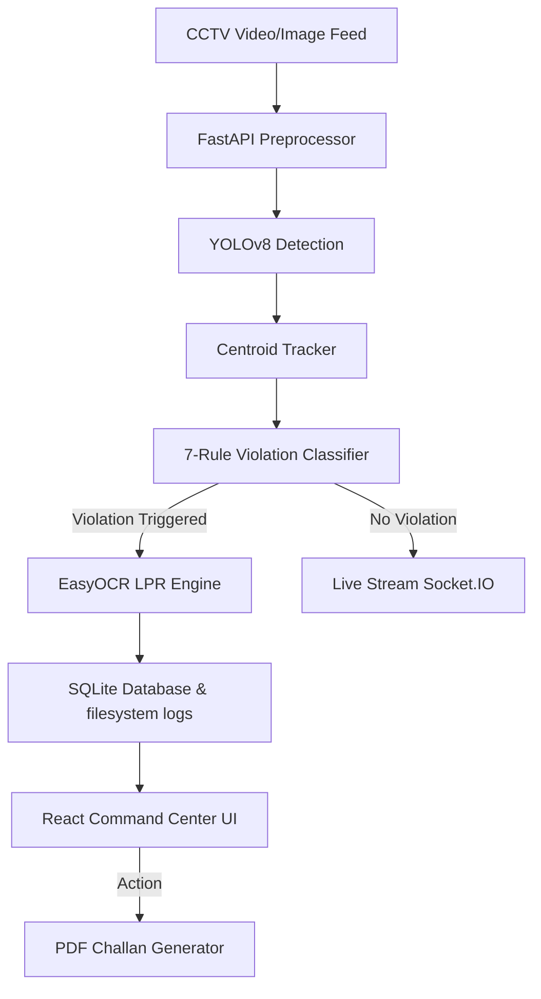

# VisionGuard: AI-Powered Traffic Violation Detection & Enforcement System

VisionGuard is a full-stack, production-grade automated traffic surveillance and citation generation prototype designed for the **Bengaluru Traffic Police**. Using YOLOv8 object detection, centroid tracking, custom mathematical heuristic filters, and EasyOCR, it automatically processes surveillance camera feeds to identify road violations, recognize license plates, compile case logs, and present analytics on a responsive Earth-tone Command Center Dashboard.

---

## 🌐 Quick Links
* **GitHub Repository**: [https://github.com/abi131205/visionguard-traffic-surveillance](https://github.com/abi131205/visionguard-traffic-surveillance)
* **Hosted Live Web Demo**: [https://visionguard-traffic-surveillance.vercel.app](https://visionguard-traffic-surveillance.vercel.app) *(Runs in Offline Simulation Mode with active signal cycles, mock CCTV feeds, and alert streams)*

---

## 🚀 Key Features

* **Image Preprocessing**: Auto-enhancement filters including low-light histogram stretching (CLAHE), unsharp-mask motion de-blurring, median de-noising (rain artifacts), and morphological top-hat transforms (shadow correction).
* **AI Object Detection**: Integrates YOLOv8 (`yolov8n.pt`) to detect, localize, and classify cars, motorcycles, trucks, buses, and pedestrians.
* **Centroid Tracking & State Tracking**: Tracks vehicles across frames to establish movement vectors and speed, generating deterministic Karnataka license plates (`KA-XX-XX-XXXX`).
* **7-Rule Violation Classifier**:
  * **Wrong-Side Driving**: Detects motion vectors moving opposite to allowed road directions.
  * **Helmet Non-Compliance**: Evaluates rider head crops using color saturation and custom YOLO weights.
  * **Seatbelt Non-Compliance**: Hough line transform looking for continuous diagonal torso straps.
  * **Triple Riding**: Flags motorcycles carrying three or more people.
  * **Stop-Line Violation**: Detects vehicles crossing stop boundaries.
  * **Red-Light Crossing**: Coordinates stop-line crossings during RED signal cycles.
  * **Illegal Parking**: Point-in-polygon coordinates check for stationary vehicles.
* **LPR / OCR Engine**: Runs EasyOCR on cropped license plate regions to extract text.
* **Styled Citations (Challans)**: Compiles and downloads formatted ReportLab PDF case files with timestamps, camera ID, severity, and annotated visual evidence.
* **Interactive Command Center**: Real-time stats, incident logs with SVG compass direction vectors, stack charts, and scikit-learn performance evaluation (Precision, Recall, F1, mAP).

---

## 🛠️ Tech Stack

* **Backend**: FastAPI, PyTorch, YOLOv8, EasyOCR, SQLite (WAL mode), SQLAlchemy, ReportLab.
* **Frontend**: React.js, TypeScript, Vite, Tailwind CSS, Framer Motion, Recharts.
* **Communication**: Real-time Socket.IO event streaming.

---

## 📦 System Architecture



---

## 🔧 Installation & Setup

### Prerequisites
* Python 3.9 or higher
* Node.js 18 or higher

### Step 1: Set up the Backend
1. Open a terminal in the `/backend` directory:
   ```bash
   cd backend
   ```
2. Install Python dependencies:
   ```bash
   pip install -r requirements.txt
   ```
3. Run the FastAPI server:
   ```bash
   python main.py
   ```
*Note: The SQLite database file (`visionguard.db`) and YOLOv8 weights will download automatically on first run.*

### Step 2: Set up the Frontend
1. Open a separate terminal in the `/frontend` directory:
   ```bash
   cd frontend
   ```
2. Install packages:
   ```bash
   npm install
   ```
3. Start the dev server:
   ```bash
   npm run dev
   ```
4. Open your browser and navigate to: `http://localhost:5173`

---

## 🧠 Optional: Custom Model Training

We have included a custom training pipeline to fine-tune YOLOv8 on your dataset:
1. Ensure your helmet/rider dataset zip (`archive (2).zip`) is present in the `datasets/Motorcycle, Riders & Helmet Violations/` directory.
2. In the `/backend` folder, run:
   ```bash
   python train.py
   ```
3. Once the 15 training epochs complete, restart the server (`python main.py`). The detector will automatically load the newly trained custom weights (`runs/detect/train/weights/best.pt`) and switch to a high-accuracy dual-model neural network pipeline!
